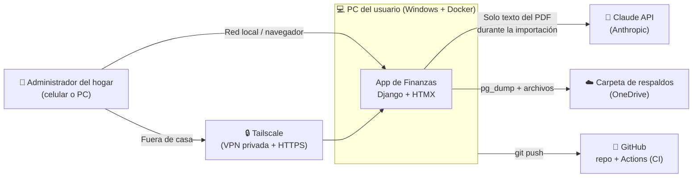
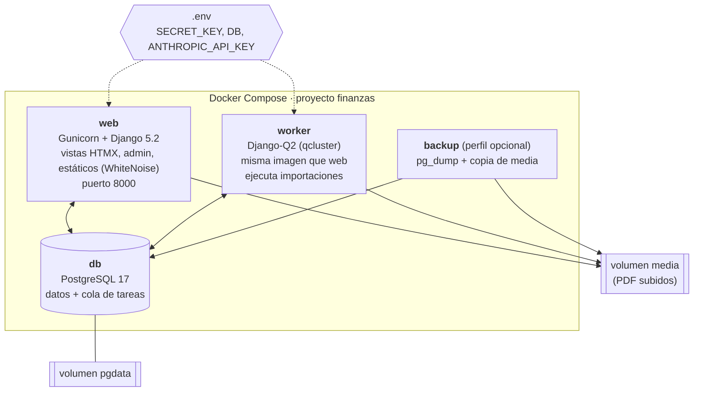
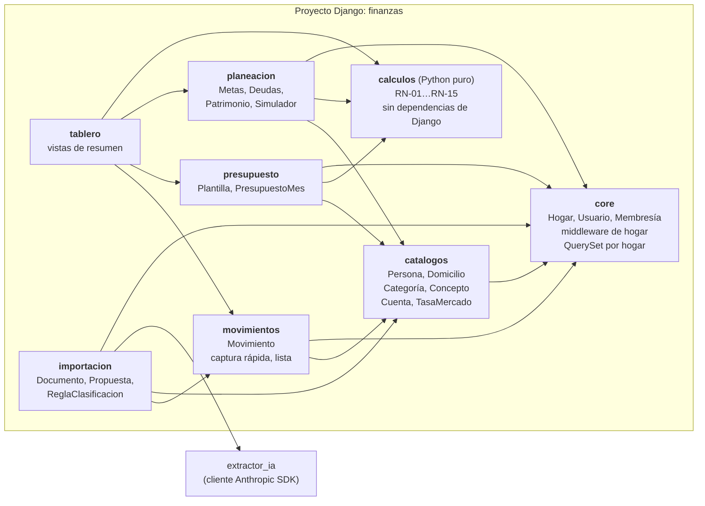
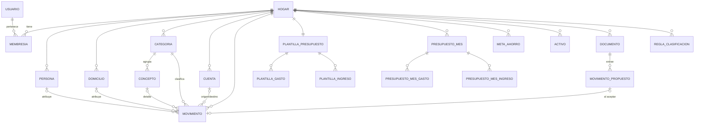
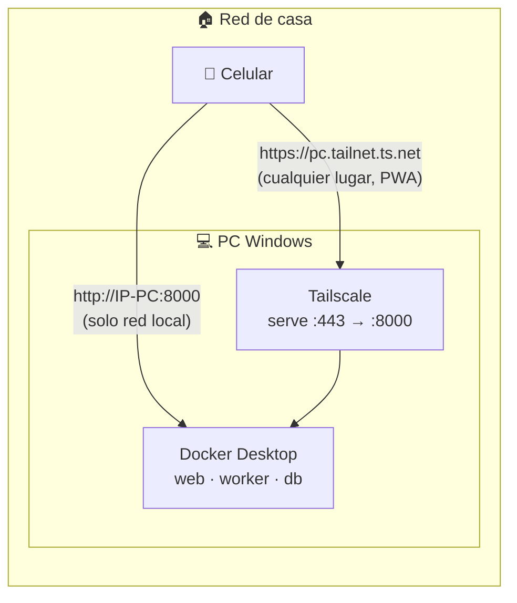
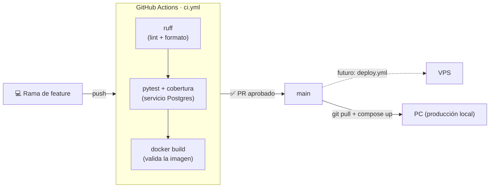

# Documento de Arquitectura
## App de Finanzas Familiares · v1

| Campo | Valor |
|---|---|
| Versión | 1.0 — aprobado |
| Fecha | 2026-10-09 |
| Relacionados | `DEF.md` (qué hace), `modelo-datos.dbml` (datos), `../CLAUDE.md` (memoria y decisiones) |

> Los diagramas están en **Mermaid**: se ven directamente en GitHub, en VS Code (extensión *Markdown Preview Mermaid Support*) o en https://mermaid.live.

---

## 1. Objetivos y restricciones de arquitectura

| Tipo | Decisión |
|---|---|
| Objetivo | Paridad con el Excel + importación de PDFs con revisión + análisis por persona y domicilio. |
| Objetivo | Base multi-hogar desde el día 1 para escalar a producto sin rehacer. |
| Restricción | Backend en **Python** (preferencia del usuario). |
| Restricción | Ejecución **local** en la PC del usuario con **Docker**; sin servidor en la nube por ahora. |
| Restricción | Uso desde el celular (PWA) → requiere HTTPS para instalarse fuera de `localhost`. |
| Restricción | Datos financieros sensibles: mínima exposición a terceros. |
| Principio | Simplicidad (YAGNI): un monolito modular, sin microservicios ni SPA. |

## 2. Vista de contexto



## 3. Vista de contenedores (Docker Compose)



**Por qué así:**
- **Una sola imagen** para `web` y `worker`: mismo código, diferente comando.
- **Django-Q2 usa Postgres como cola**: no hace falta Redis, un servicio menos que operar.
- **Volúmenes Docker** (no carpetas de OneDrive) para `pgdata` y `media`: evita la corrupción por sincronización. Los respaldos sí van a OneDrive.
- En desarrollo, `docker-compose.override.yml` monta el código y usa `runserver` con recarga automática.

## 4. Vista de componentes (monolito modular)



| App | Responsabilidad | Depende de |
|---|---|---|
| `core` | Tenencia: hogar activo en `request.hogar`; `HogarQuerySet.for_hogar()`; usuario personalizado por email. | — |
| `catalogos` | Dimensiones y cuentas; siembra inicial (12 categorías, tasas de mercado). | core |
| `movimientos` | CRUD de movimientos, captura rápida, filtros y totales. | catalogos |
| `presupuesto` | Plantilla, generación del mes y resumen. | catalogos, calculos |
| `planeacion` | Metas, deudas (vistas sobre `cuenta`), patrimonio y simulador. | catalogos, calculos |
| `tablero` | Composición de lectura; no tiene modelos propios. | movimientos, presupuesto, planeacion |
| `importacion` | Carga, cola, extracción, reglas, duplicados y revisión. | movimientos, catalogos, extractor |
| `calculos` | Funciones puras con `Decimal`. Son el corazón probado contra el Excel. | — |

**Regla de dependencias:** `calculos` no importa nada de Django; las vistas no contienen fórmulas.

## 5. Modelo de datos (resumen)

El detalle completo (campos, tipos, índices y enums) está en **`modelo-datos.dbml`**.



## 6. Flujo de importación de documentos

```mermaid
sequenceDiagram
    autonumber
    actor U as Usuario
    participant W as web (Django)
    participant DB as PostgreSQL
    participant Q as worker (Django-Q2)
    participant X as extractor_ia
    participant C as Claude API

    U->>W: Sube PDF/ZIP (P10)
    W->>W: Calcula SHA-256; descomprime ZIP
    alt hash ya existe en el hogar
        W-->>U: "Ya importado el <fecha>"
    else nuevo
        W->>DB: Documento(estado=subido) + archivo en media
        W->>Q: Encola procesar_documento(id)
        W-->>U: Lista con estado (HTMX consulta cada 3 s)
        Q->>DB: estado=procesando
        Q->>Q: pypdf → texto (local)
        alt sin texto
            Q->>DB: estado=error ("requiere OCR")
        else con texto
            Q->>X: texto + catálogos del hogar (categorías, conceptos, personas, domicilios, cuentas)
            X->>C: messages.parse (salida estructurada JSON Schema)
            C-->>X: tipo, emisor, periodo, movimientos[], confianza
            X-->>Q: resultado validado (Pydantic)
            Q->>Q: Aplica reglas del hogar (RN-12)
            Q->>DB: Busca duplicados (RN-11)
            Q->>DB: MovimientoPropuesto[] + tokens/costo; estado=por_revisar
        end
    end
    U->>W: Revisa (P11): acepta / edita / descarta
    W->>DB: Crea Movimiento(origen=importado); opcional crea Regla
    W->>DB: Documento estado=confirmado
```

### 6.1 Diseño de la llamada a Claude
| Aspecto | Decisión |
|---|---|
| SDK | `anthropic` (Python oficial) |
| Modelo | `claude-opus-5-5` (configurable con la variable `CLAUDE_MODEL`) |
| Esfuerzo | `output_config.effort = "low"`: es una extracción, no razonamiento profundo; se sube a `medium` si la calidad no alcanza. |
| Salida | Estructurada: `client.messages.parse()` con un esquema Pydantic (`DocumentoExtraido` → `MovimientoExtraido[]`). Sin parseo de texto libre. |
| Entrada | **Solo el texto** extraído localmente (no el PDF); menos datos enviados y menos tokens. Catálogos del hogar en el prompt para que la IA sugiera IDs existentes. |
| Caché | Prompt de sistema e instrucciones estables primero, con `cache_control`, para abaratar documentos consecutivos. |
| Rechazos | Se habilita `fallbacks: "default"` (beta `server-side-fallback-2026-07-01`) y se revisa `stop_reason` antes de leer el contenido. |
| Errores | Cadena de excepciones tipadas del SDK: `RateLimitError`/`APIConnectionError` → reintento de Django-Q2 con espera; `BadRequestError` → estado `error` con mensaje. |
| Costo | Precio $4 / $20 por millón de tokens (entrada/salida). Un estado de cuenta de ~8 páginas ≈ 15k tokens de entrada + 3k de salida ≈ **0.12 USD**. Con ~10 documentos al mes, **≈ 1–2 USD/mes**. Se registra por documento (RF-IMP-13). |
| Privacidad | Los datos enviados por API no se usan para entrenar modelos. Opción futura: parsers deterministas por banco, sin IA, para los formatos recurrentes. |

## 7. Vista de despliegue

### 7.1 Ahora: local en la PC


- **Tailscale Serve** da HTTPS con certificado válido, que la PWA necesita para instalarse, y no expone nada a internet.
- La app solo está disponible mientras la PC está encendida (limitación aceptada para la v1).

### 7.2 Después: VPS (sin cambios de código)
Mismo `docker-compose.yml` en un VPS Linux, con Caddy como proxy HTTPS. Se agrega un job de despliegue en GitHub Actions (SSH → `docker compose pull && up -d` → `migrate`).

## 8. Integración y entrega continua



- **Ahora:** CI en cada push o PR (lint, pruebas, build). Para "desplegar" en la PC: `git pull && docker compose up -d --build` (el contenedor aplica las migraciones al iniciar). Se documenta como `make deploy` / script `deploy.ps1`.
- **Después:** `deploy.yml` publica la imagen en GHCR y la despliega en el VPS.
- Las pruebas de CI **nunca** llaman a la Claude API real: el extractor se simula con respuestas grabadas sobre textos sintéticos.

## 9. Pila tecnológica

| Capa | Tecnología | Motivo |
|---|---|---|
| Lenguaje | Python 3.12 | Preferencia del usuario; ya instalado. |
| Framework | Django 5.2 LTS | Auth, admin, ORM, migraciones y formularios incluidos; soporte hasta 2028. |
| Interactividad | HTMX 2 + Alpine.js (mínimo) | Interfaz dinámica sin SPA ni build de JS. |
| Estilos | Tailwind CSS (CLI standalone, sin Node) | Mobile-first rápido. |
| Gráficas | Chart.js | Ligera; suficiente para barras y donas. |
| PWA | Manifest + service worker (caché de estáticos) | Instalable en el celular. |
| Base de datos | PostgreSQL 17 | `numeric` exacto, `jsonb`, cola de Django-Q2. |
| Tareas | Django-Q2 (broker ORM) | Sin Redis. |
| PDF | pypdf (+ zipfile) | Ya probado con los documentos del usuario: todos tienen texto. |
| IA | Anthropic Python SDK, `claude-opus-5-5` | Extracción estructurada multi-formato. |
| Servidor | Gunicorn + WhiteNoise | Simple; sin Nginx en local. |
| Dependencias | uv + `pyproject.toml` | Rápido y reproducible (lockfile). |
| Calidad | ruff, pytest, pytest-django, factory_boy, coverage | CI. |
| Contenedores | Docker + Compose v5 | Disponibles en la PC. |

## 10. Estructura del repositorio (propuesta)

La aplicación vive en `Finanzas/app_finanzas/`, que es **la raíz del repositorio git**. Los datos personales quedan fuera del repo, en carpetas hermanas, así que no pueden colarse a git ni a la imagen Docker.

```
Finanzas\                        (OneDrive)
├── 2026\                        ← datos personales (FUERA del repo)
├── CLAUDE.md                    ← memoria del proyecto (fuera de git)
└── app_finanzas\                ← raíz del repo git
    ├── .gitignore  .gitattributes  .dockerignore
    ├── .github/workflows/ci.yml
    ├── docker/
    │   ├── Dockerfile
    │   └── entrypoint.sh            (migrate)
    ├── docker-compose.yml
    ├── docker-compose.override.yml  (desarrollo)
    ├── .env.example                 (.env real NO va a git)
    ├── pyproject.toml / uv.lock
    ├── docs/                        (ARQUITECTURA.md, DEF.md, modelo-datos.dbml, superpowers/plans/)
    ├── scripts/                     (backup.ps1, restore.ps1, deploy.ps1)
    ├── finanzas/                    (settings, urls)
    ├── apps/
    │   ├── core/  catalogos/  movimientos/  presupuesto/
    │   ├── planeacion/  tablero/  importacion/
    │   └── calculos/                (Python puro)
    ├── templates/  static/
    └── tests/
        └── fixtures/                (textos SINTÉTICOS; nunca PDFs reales)
```

## 11. Seguridad y privacidad

| Riesgo | Mitigación |
|---|---|
| Fuga entre hogares (futuro multiusuario) | `request.hogar` + manager por hogar en todos los modelos; prueba automatizada que intenta leer datos de otro hogar. |
| Datos reales en git | `.gitignore` de `media/`, `.env` y `*.pdf`; fixtures sintéticos; pre-commit que bloquea PDFs. |
| Clave de API expuesta | Solo en `.env`; nunca en logs ni en la interfaz. |
| Acceso no autorizado | Login obligatorio, contraseñas con hash de Django, solo HTTPS remoto vía Tailscale, sin puertos abiertos al router. |
| Pérdida de datos | Respaldo diario (Programador de tareas de Windows → `scripts/backup.ps1`) a OneDrive; restauración probada (RF-DAT-02). |
| Prompt injection desde el PDF | El texto del documento va como dato, no como instrucción; la salida está restringida al esquema; el usuario revisa todo antes de guardar. |

## 12. Calidad y pruebas

| Nivel | Qué se prueba | Herramienta |
|---|---|---|
| Unitarias | `calculos`: todas las RN con los valores "✔" del DEF (golden tests contra el Excel). | pytest |
| Modelo/servicio | Generación del presupuesto mensual, reglas, duplicados, aislamiento por hogar. | pytest-django + factory_boy |
| Importación | Extractor con cliente simulado; textos sintéticos de banco, nómina y recibo. | pytest + mocks |
| Vistas | Flujos HTMX principales (captura, revisión). | Django test client |
| Manual / aceptación | Criterios de la sección 8 del DEF con los documentos reales, **localmente**. | Checklist |

## 13. Decisiones de arquitectura (ADR resumidas)

| # | Decisión | Alternativas descartadas | Motivo |
|---|---|---|---|
| ADR-01 | Monolito Django + HTMX | FastAPI + React; Streamlit | Un lenguaje, más rápido de construir; Streamlit no sirve como producto. |
| ADR-02 | Multi-hogar desde v1 | Single-tenant | Evita una migración costosa al volverse producto. |
| ADR-03 | PostgreSQL desde v1 | SQLite | Mismo motor local y en producción; `numeric`, `jsonb`, cola. |
| ADR-04 | Django-Q2 con broker ORM | Celery + Redis | Un servicio menos. |
| ADR-05 | IA para extracción con revisión obligatoria | Parsers por banco; carga automática sin revisión | Funciona con cualquier formato; el usuario conserva el control. |
| ADR-06 | Enviar texto, no el PDF | Bloque `document` PDF | Menos datos expuestos y menos tokens; los PDFs tienen texto. |
| ADR-07 | Ejecución local + Tailscale | VPS / PaaS | Decisión del usuario: costo cero y datos en casa. |
| ADR-08 | Repo en `Finanzas/app_finanzas/` (OneDrive), separado de los datos personales, con mitigaciones | Repo fuera de OneDrive; repo en la raíz `Finanzas/` | Decisión del usuario: la app en su propia carpeta para no mezclar archivos; los datos personales quedan fuera del repo por construcción. Mitigaciones: (1) Postgres y media en **volúmenes Docker con nombre**, nunca en carpetas sincronizadas; (2) el entorno virtual de Python vive dentro del contenedor o fuera de OneDrive (`UV_PROJECT_ENVIRONMENT`), no en `.venv/` del repo; (3) GitHub es la copia de referencia del código: hacer push con frecuencia; (4) si aparece un conflicto de OneDrive en `.git`, se recupera con un clon nuevo. |
